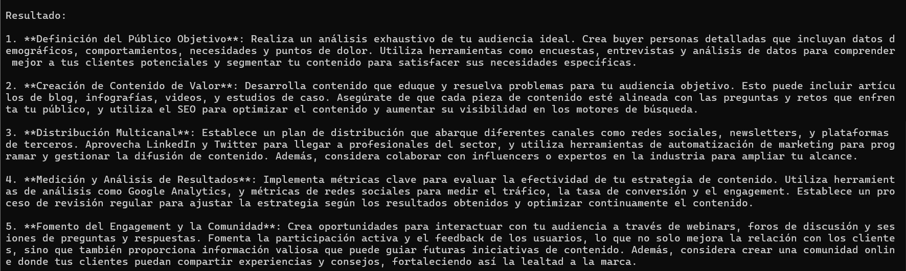

# CrewAI Multi-Agent Marketing App

A multi-agent LLM application that simulates a SaaS B2B content marketing team using CrewAI.

---

## 🚀 Overview

This project is a **multi-agent LLM application built with CrewAI** that simulates a content marketing team for a SaaS B2B company.

The system coordinates multiple specialized AI agents (strategy, SEO, content, and distribution) to collaboratively generate a structured content marketing plan based on a single business input.

---

## 🧠 Problem & Solution

**Problem:**  
Early-stage SaaS companies often lack the resources to hire a full content marketing team, yet they still need a consistent and strategic content plan.

**Solution:**  
This application replaces a traditional marketing team with a coordinated group of AI agents, each responsible for a specific role, producing a complete and actionable content marketing strategy in seconds.

---

## 🏗 Architecture

The application follows a simple but scalable architecture:

- **CLI interface (`src/app.py`)**: entry point and user interaction
- **CrewAI framework**: orchestrates agents and tasks
- **LLM-powered agents**: each agent has a clear role and goal
- **Notebook version**: exploratory and educational version of the project

The design separates experimentation (notebooks) from production-ready execution (Python scripts).

---

## 🤖 Agents & Responsibilities

The system is composed of multiple specialized agents:

- **Strategy Agent**: defines overall content goals and positioning
- **SEO Agent**: optimizes topics and keywords for search engines
- **Content Agent**: proposes content formats and ideas
- **Distribution Agent**: suggests promotion and distribution channels

All agents collaborate through CrewAI to produce a unified result.

---

## 🛠 Tech Stack

- Python 3.11  
- CrewAI  
- OpenAI-compatible LLMs  
- Pydantic  
- Git & GitHub  

---

## ▶️ Demo

Example output generated by the application:



📄 **Sample generated output (Markdown):**  
👉 [View latest_result.md](outputs/latest_result.md)


---

## ⚙️ Installation & Usage

Clone the repository:

```bash
git clone https://github.com/Mojedano/crewai-multiagent-marketing-app.git
cd crewai-multiagent-marketing-app
```
---

## 🧩 Install dependencies

```md
Install dependencies:

```bash
pip install -r requirements.txt
```
---

## 🧩 Environment variables + Run app

```md
Create a `.env` file based on `.env.example` and add your API key.

Run the application:

```bash
python src/app.py
```
---

## 🧪 Development Notes

This project was initially developed in a Jupyter Notebook for rapid experimentation.

It was later refactored into a CLI-based Python application for better structure and reusability.

The current architecture is intentionally simple but designed to be easily extended.

---

## 🗺 Roadmap

- [ Add configuration via CLI arguments ] 

- [ Support multiple LLM providers ] 

- [ Persist results to files (Markdown / JSON) ]

- [ Optional web interface ] 

---

## 👤 Author

Developed by David García Mojedano
AI & Multi-Agent Systems Enthusiast

This project is part of my professional portfolio.

---


